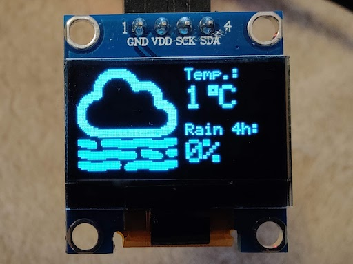

# Weather display

A little Node app which displays current weather data on a tiny SSD1306/SSD1315 OLED display.
Built and tested with a Raspberry Pi.



Displays the following information:
* Current weather condition as an icon on the left.
* Current temperature on the top right.
* Probability of precipitation in the upcoming 4 hours on the bottom right.

## Setup

### Environment variables

Set the following variables in a `.env` file:

```dotenv
DISPLAY_I2C_ADDRESS= # I2C address of the display. Default value: 0x3C
CRON_CONFIG= # Cron time configuration for data updates. Default value: "0 */10 * * * *" (every 10 minutes).
WEATHER_LATTITUDE= # Geographic coordinate to be used for grabbing weather information. Required.
WEATHER_LONGITUDE= # Geographic coordinate to be used for grabbing weather information. Required.
WEATHER_APPID= # OpenWeather API key. Required.
WEATHER_UNITS= # Unit configuration for OpenWeather API. Default value: metric.
```

### PM2

PM2 process manager can be used to keep the app always running.

Install PM2 globally:
```
npm i -g pm2
pm2 startup
```

Set up `weather-display` process:
```
pm2 start ecosystem.config.js
pm2 save
```

Done! From now on, the process will start on boot.

## Icons

Designed by [bqlqn from Flaticon](https://www.flaticon.com/authors/bqlqn)
