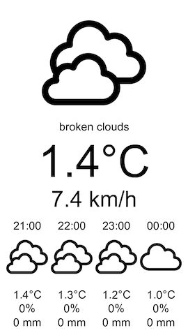

# Weather display

A little Node web server that serves a PNG image of weather data to be displayed on an M5Paper device.



## Setup

### Environment variables

Set the following variables in a `.env` file:

```dotenv
WEATHER_LATITUDE= # Geographic coordinate to be used for grabbing weather information. Required.
WEATHER_LONGITUDE= # Geographic coordinate to be used for grabbing weather information. Required.
WEATHER_APPID= # OpenWeather API key. Required.
WEATHER_UNITS= # Unit configuration for OpenWeather API. Default value: metric.
```

### Usage with Docker

Start with Docker CLI:

```bash
docker run \
  --detach \
  --env-file .env \
  --restart unless-stopped \
  --name weather-display \
  --publish 3000:3000 \
  ghcr.io/lpgera/weather-display:m5paper-backend
```

Or you can use the `docker-compose.yml` file from the repository and run:

```bash
docker-compose up -d
```

### Usage with PM2

As an alternative to Docker, [PM2](https://pm2.keymetrics.io/) process manager can also be used to keep the app always running.

Install PM2 globally:

```
npm i -g pm2
pm2 startup
```

Set up `weather-display` process:

```
pm2 start ecosystem.config.js
pm2 save
```

Done! From now on, the process will start on boot.

## Icons

Designed by [bqlqn from Flaticon](https://www.flaticon.com/authors/bqlqn)
